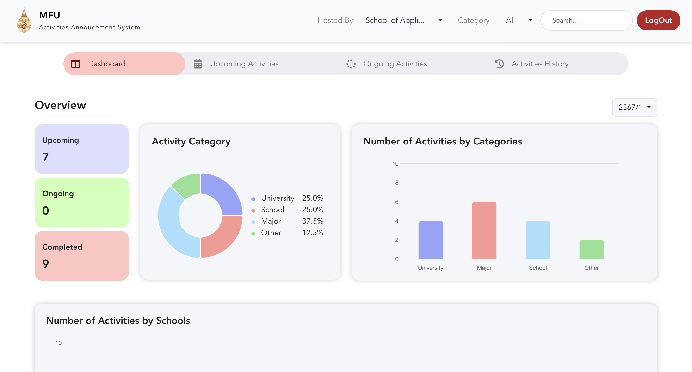
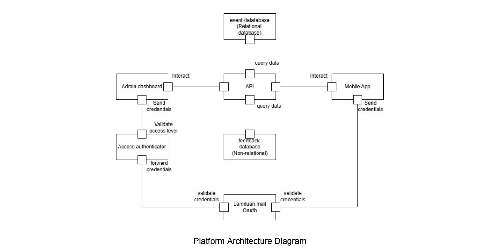

# Centralized Activities Announcement System (Dashboard)

## Overview  
The Centralized Activities Announcement System is designed to streamline activity and event management for MFU students, staff, and faculty. This platform provides a unified, secure, and user-friendly system to announce events, visualize data, and engage participants in real time.  

---
## Table of Contents  
- [Features](#features)  
  - [Web Application](#web-application)  
- [Tech Stack](#tech-stack)  
  - [Frontend](#frontend)  
  - [Backend](#backend)  
  - [Authentication](#authentication)  
- [Supporting Documents](#supporting-documents)  
  - [Business Model Canvas (BMC)](#1-business-model-canvas-bmc)  
  - [UI/UX Design](#2-uiux-design)  
  - [Architecture Design](#3-architecture-design)  
- [Installation and Setup](#installation-and-setup)  
- [License](#license) 

## Features  

### Web Application  


- **Single Page Application (SPA):** Seamless navigation with no unnecessary loading.
- **Login Security:**  
  - Users log in with correct credentials.  
  - Failed attempts invoke increasing timers (1 min, 3 min, 5 min, and 30 min) with no bypass options.  
  - Route guards prevent unauthorized URL-based access.
- **Navbar State Management with Pinia:**  
  - The **Navbar** leverages **Pinia** for state management, ensuring smooth handling of user interactions such as selecting a school, category, or inputting a search query.  
  - **Pinia** enables real-time updates by storing the state of the filters (school and category) and the search query, allowing the application to dynamically adjust content based on user selection.  
  - This state is shared across components, ensuring consistency and immediate updates, making the user experience seamless and responsive.

- **Dashboard Visualizations:**  
  - **Doughnut Chart:** Percentage of activities by category.  
  - **Bar Charts:** Number of activities by category and school.  
  - Filters update charts dynamically in real time.  
- **Activity Management:**  
  - Create, edit, and delete activities with real-time updates.  
  - Role-based restrictions for activity editing.  
- **Real-Time Updates:**  
  - Activities automatically move between **Upcoming**, **Ongoing**, and **History** tabs based on their timings.  
  - Persistent user login prevents unnecessary logins unless manually logged out or inactive.
 
## Tech Stack  

### Frontend  
- **Vue.js**: Framework for building the web interface.  
- **Bootstrap & Sass**: Styling and responsive design.  
- **Pinia**: State management.  
- **Vue-Toastification**: Notifications and alerts.  
- **FontAwesome**: Icons for UI elements.  

### Backend  
- **Strapi**: Headless CMS for API management.  

### Authentication  
- **Firebase Authentication**: Secure login and user management.  

---
## Supporting Documents  

### 1. Business Model Canvas (BMC)  
A comprehensive strategy focusing on:  
- **Value Proposition:** Centralized platform for event announcements with search and filtering features.  
- **Key Activities:** Development, maintenance, content management, and user engagement.  
- **Revenue Streams:** Supported by university funding and partnerships.  
- **Key Partners:** University administration, IT department, clubs, and external sponsors.  

### 2. UI/UX Design  
Focused on accessibility, engagement, and usability:  
- **Core Needs:** Easy navigation, responsive layouts, and compliance with accessibility standards.  
- **Design System:**  
  - Typography: Inter font for readability.  
  - Color Palette: Reflecting MFU branding with red, black, and system indicator colors.  
  - Card-Based Layout: Intuitive and visually appealing announcements.  
- **Prototypes:** Wireframes and scenarios for user flows, including login, viewing activities, and creating events.  

### 3. Architecture Design  

Robust multi-component architecture:  
- **Admin Dashboard:** For event management and analytics.  
- **Mobile App:** User interface for students to explore events.  
- **API:** Unified backend for web and mobile integration.  
- **Databases:**  
  - Event Database: Stores details like name, date, and location.  
  - Feedback Database: Collects user feedback and ratings.  
- **Authentication:** OAuth2 for secure login using Lamduan mail, ensuring access control for admins and users.

<br>
More Information : https://drive.google.com/drive/folders/1jAG8-DQukddiW7rFqlANdS7KlqtRPNJT

---

## Installation and Setup  
1. Clone the repository:  
   ```bash
   git clone https://github.com/fisheeesh/mfu-activities-announcement-system.git
   cd mfu-activities-announcement-system
2. Install Dependencies:
   ```bash
   npm install
3. Start the User Interface:
   ```bash
   cd frontend
   npm run serve
4. Start the Server:
   ```bash
   cd backend
   npm run develop

## License

This project is licensed under the **MIT License**.  

[](https://opensource.org/licenses/MIT)  

You can view the full license [here](LICENSE).
